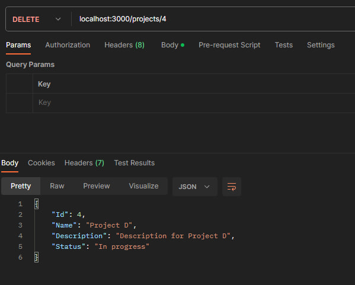

# Тестування працездатності системи за допомогою Postman

## Запуск сервера

## GET /projects

## POST /projects

## POST /projects (validation error)

## PATCH /projects/:projectId

## DELETE /projects/projectId

## DELETE /projects/projectId (validation error)

## GET /role-grant

## POST /role-grant

## POST /role-grant (validation error)

## DELETE /role-grant

